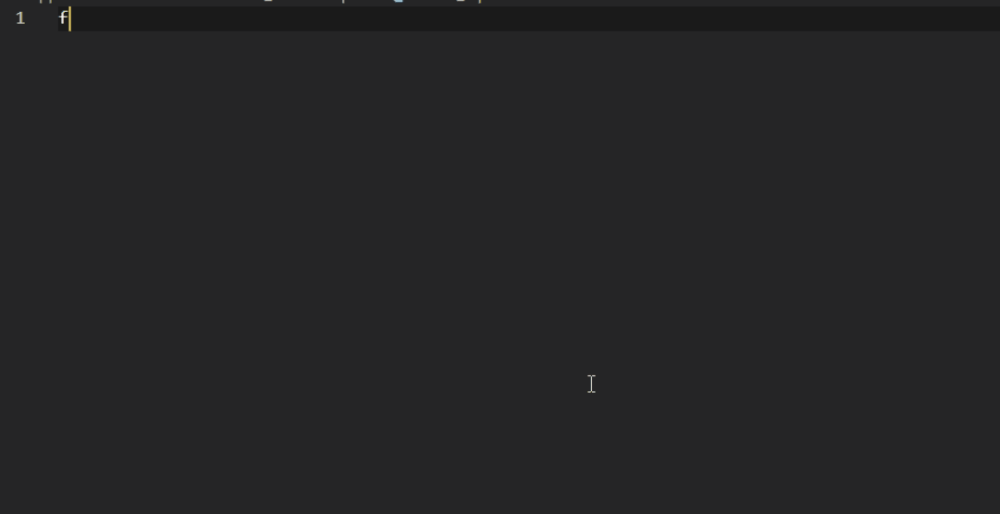

# 📦 Formz Snippets  
### Clean & Complete Formz Input Generators for Flutter

A curated set of **ready-to-use Formz input snippets** designed for Flutter & BLoC developers.  
This extension eliminates boilerplate and helps you create **strongly-typed, reusable, scalable input models** for Formz (0.8.0+).

---

## 🚀 Features

- 15+ production-ready Formz input templates  
- Consistent naming and structure  
- Strongly typed validation logic  
- Supports **String, Int, Double, Email, Mobile, Date, Enum, JSON, Regex, OTP**, and more  
- Highly reusable patterns for BLoC + Formz apps  
- All snippets follow **FormzInput<T, ErrorType>** pattern  
- Written to avoid constructor issues in newer Formz versions  

---

## 🧠 Why This Extension?

Formz is powerful — but writing input classes repeatedly is not.  
This extension provides **everything you need**, instantly:

- Cleaner forms  
- Cleaner states  
- Cleaner Cubits/BLoCs  
- Cleaner validators  
- Zero repeating boilerplate  

If you use BLoC + Formz, this extension saves **hours**.

---

## ⌨️ Snippet Prefixes

| Prefix | Description |
|--------|-------------|
| `formzString` | String input with basic validation |
| `formzStringNullable` | Nullable string input |
| `formzInt` | Integer input |
| `formzDouble` | Double input |
| `formzEmail` | Email validator (regex) |
| `formzPassword` | Password with length rules |
| `formzMobile` | Indian mobile validator |
| `formzEnum` | Enum-based Formz input |
| `formzDate` | DateTime input |
| `formzDateNullable` | Nullable DateTime input |
| `formzOptional` | Optional-but-validated string |
| `formzRegex` | Custom regex validator |
| `formzPhoneCC` | Mobile with country code |
| `formzUsername` | Username rules |
| `formzOtp` | OTP input (4–6 digits) |
| `formzUrl` | URL validator |
| `formzJson` | JSON validation input |

---

## 📝 Example Output (String Input)

Typing:

```
formzString → TAB
```

Produces:

```dart
enum NameValidationError { invalid }

class NameInput extends FormzInput<String, NameValidationError> {
  const NameInput.pure() : super.pure('');
  const NameInput.dirty([String value = '']) : super.dirty(value);

  @override
  NameValidationError? validator(String value) {
    if (value.isEmpty) return NameValidationError.invalid;
    return null;
  }
}
```

100% Formz-correct.  
100% BLoC-compatible.

---

## ⚙️ Recommended VS Code Settings

If IntelliSense overrides snippet expansion when pressing TAB or ENTER,  
add this to your VS Code settings.json:

```json
"editor.acceptSuggestionOnEnter": "off",
"editor.acceptSuggestionOnCommitCharacter": false
```
---

## 📥 Installation

1. Open VS Code  
2. Go to **Extensions → Search: “Formz Snippets”**  
3. Install  
4. Start typing a snippet like:  
   ```
   formzEmail
   ```  
5. Press **TAB**

Done. 🎉

---

## 🎬 Demo




---

## 🛠️ Requirements

- Flutter  
- Dart  
- Formz 0.8.0+  
- VS Code

---

## 🐛 Issues / Feature Requests

Have ideas or found something to improve?

👉 https://github.com/paanoop/formz-snippets/issues

Contributions welcome.

---

## ❤️ Author

**Anoop P. A**  
Publisher: `paanoop`  
Passionate about Flutter, clean architecture, and developer tooling.

---

## 📄 License

MIT — free to use in commercial and open-source projects.
